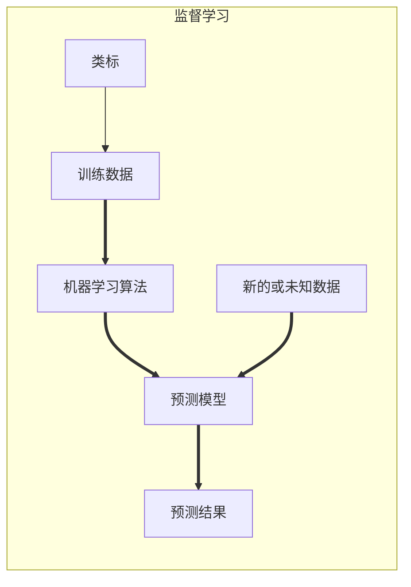
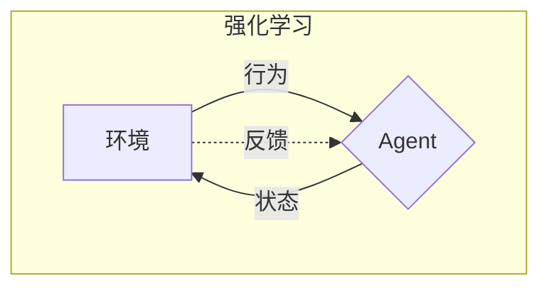

# 概要

机器学习算法能够实现**数据转换为知识**.

## 监督学习

- 监督学习的主要目的是使用有类标的训练数据构建模型, 然后使用经过训练得到的模型对未来数据进行预测.

## 强化学习

- 强化学习的目标是构建一个系统 (Agent), 在与环境 (environment) 交互的过程中提高系统的性能. 环境的当前状态信息中通常包含一个**反馈** (reward) 信号, 这个反馈值是一个通过反馈函数产生的对当前系统行为的评价. 通过与环境的交互, Agent 可以通过学习来得到一系列的行为, 通过探索性的试错或者借助精心设计的激励系统使得正向反馈最大化.

## 无监督学习

- 无监督学习, 我们可以在没有已知输出变量和反馈函数指导下提取有效信息来探索数据的整体结构.

**通过聚类发现数据的子群**: 在没有任何相关先验信息的情况下, 聚类可以帮助我们将数据划分为有意义的小的组别 (即簇 (cluster)). 对数据进行分析时, 生成的每个簇中内部成员之间具有一定的相似度, 而与其他簇中的成员则具有较大的不同. 聚类获取数据的结构信息, 以及导出数据间有价值的关系.

**数据压缩中的降维**: 是数据特征预处理时常用的技术, 用于清除数据中的噪声, 它能够在最大程度保留相关信息的情况下将数据压缩到一个维度较小的子空间, 但同时可能会降低某些算法在准确性方面的性能. 同时, 降维在可视化方面也是非常有用的.

# 学习资源

- [机器学习资源 Machine learning Resources](https://allmachinelearning.github.io/MachineLearning/)
- [机器学习系统设计](https://github.com/hfl15/MachineLearning/tree/master/book_building_machine_learning_system_with_python)
- [BuildingMachineLearningSystemsWithPython](https://github.com/luispedro/BuildingMachineLearningSystemsWithPython)
- [python-machine-learning-book-2nd-edition](https://github.com/BookCollections/python-machine-learning-book-2nd-edition)
- [机器学习的数学基础](https://www.cnblogs.com/q735613050/p/9126826.html)