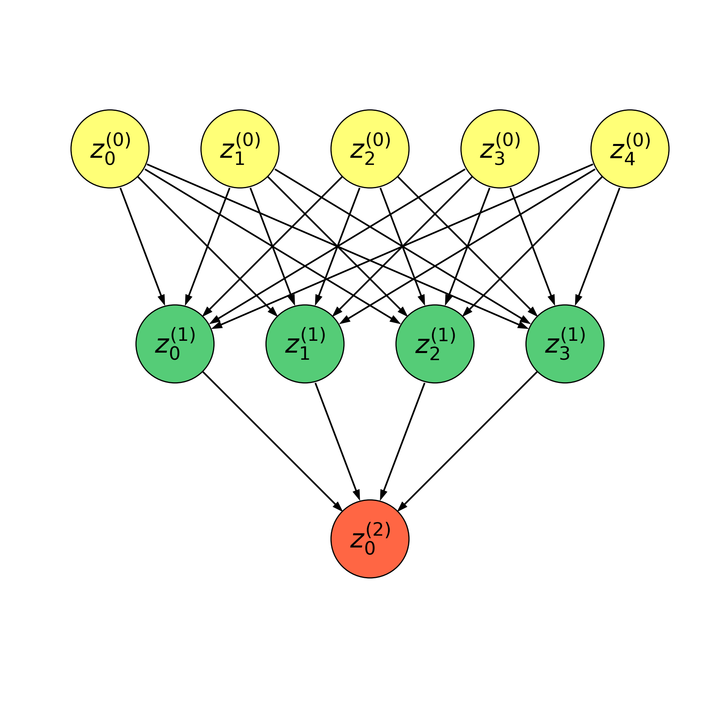

## 计算图

```{.python .input}
import sys
sys.path.append('E:/zlab/')

from plotnet import draw_feed_forward, DynamicShow
```

```{.python .input}
with DynamicShow((6, 6), '计算图.png') as d:  # 隐藏坐标轴
    draw_feed_forward(d.ax, num_node_list=[5, 4, 1])
```



计算图 (computational graph) 模型将计算形式转换为图形语言。图中的每一个**节点**表示一个变量。变量可以是标量、向量、矩阵、张量或者是另一个类型的变量 (此节点通常被称为操作)。图中的边上承载着权重值。**操作**是指一个或多个变量的简单函数。